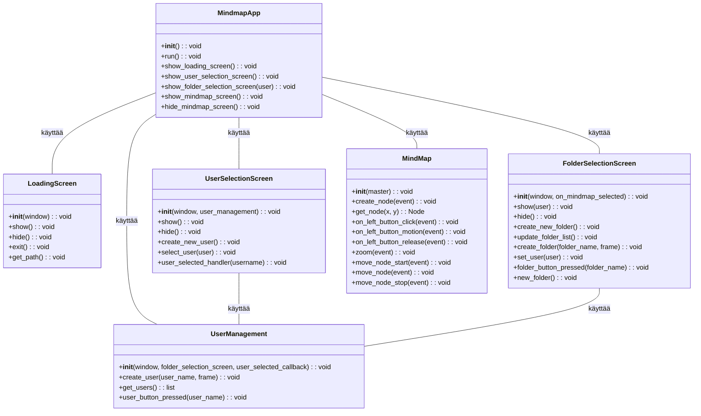

```mermaid
classDiagram

class MindmapApp {
    +__init__(): void
    +run(): void
    +show_loading_screen(): void
    +show_user_selection_screen(): void
    +show_folder_selection_screen(user): void
    +show_mindmap_screen(): void
    +hide_mindmap_screen(): void
}

class LoadingScreen {
    +__init__(window): void
    +show(): void
    +hide(): void
    +exit(): void
    +get_path(): void
}

class UserSelectionScreen {
    +__init__(window, user_management): void
    +show(): void
    +hide(): void
    +create_new_user(): void
    +select_user(user): void
    +user_selected_handler(username): void
}

class UserManagement {
    +__init__(window, folder_selection_screen, user_selected_callback): void
    +create_user(user_name, frame): void
    +get_users(): list
    +user_button_pressed(user_name): void
}

class FolderSelectionScreen {
    +__init__(window, on_mindmap_selected): void
    +show(user): void
    +hide(): void
    +create_new_folder(): void
    +update_folder_list(): void
    +create_folder(folder_name, frame): void
    +set_user(user): void
    +folder_button_pressed(folder_name): void
    +new_folder(): void
}

class MindMap {
    +__init__(master): void
    +create_node(event): void
    +get_node(x, y): Node
    +on_left_button_click(event): void
    +on_left_button_motion(event): void
    +on_left_button_release(event): void
    +zoom(event): void
    +move_node_start(event): void
    +move_node(event): void
    +move_node_stop(event): void
}

MindmapApp -- LoadingScreen: käyttää
MindmapApp -- UserSelectionScreen: käyttää
MindmapApp -- UserManagement: käyttää
MindmapApp -- FolderSelectionScreen: käyttää
MindmapApp -- MindMap: käyttää
UserSelectionScreen -- UserManagement: käyttää
FolderSelectionScreen -- UserManagement: käyttää

```
