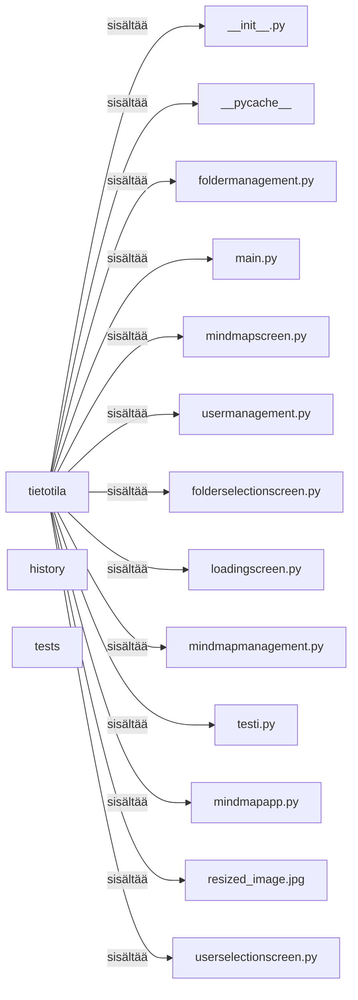
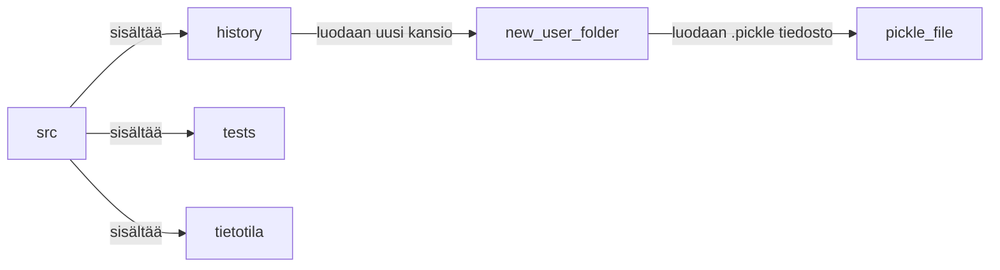

# Arkkitehtuurikuvaus

## Rakenne

Ohjelman pakkausrakenne on seuraava: 

## Käyttöliittymä

Käyttöliittymä sisältää kuusi erillistä näkymää:

-latausnäyttö

-käyttäjän valinta ja luominen

-kansion valinta ja luominen

-miellekartta näkymä

-muistikorttien luomiseen tarkoitettu näkymä

-muistikorttien harjoitteluun tarkoitettu näkymä

Jokainen näkymä käyttöliittymässä on toteutettu omana luokkanaan ja useat niistä sijaitsevat eri moduuleissa. 

## Sovelluslogiikka

Ohjelman osat jotka eivät käytä tkinter kirjastoa ovat eritelty loppupäätteellä ...management. 
Nämä moduulit vastaavat ohjelman logiikasta. 

Puolestaan screen päätteiset moduulit vastaavat ui puolesta. 

[sekvenssikaavio](https://github.com/ErikHuuskonen/ot-harjoitustyo/blob/main/dokumentaatio/sekvenssikaavio.md)

## Tietojen pysyväistallennus

Ohjelman juuressa oleva kansio src sisältää erillisen kansion nimeltä history jonka tarkoituksena on säilyttää .pickle tiedostoja. 

Näihin tiedostoihin kirjoitetaan miellekarttojen sisältö, käyttäjät sekä tiedosojen nimet. 

## Päätoiminnallisuudet

Ohjelman päätoiminnallisuudet ovat seuraavat: 

-Käyttäjien luominen ja valinta
-Uusien miellekartta tiedostojen luominen ja vanhojen valinta
-Miellekarttanäkymässä miellekarttojen muodostaminen
-Miellekartan avulla quizlet ja anki tyylisten muistikortti kokonaisuuksien luominen ja hallinta

## Ohjelman rakenteeseen jääneet heikkoudet

Ohjelmani rakenteeseen on jääynyt ainakin seuraavat heikkoudet:

- Ohjelman ui ja logic eivät ole tarpeeksi hyvin eritelty

-Ohjelmani kansiorakenne ja moduulien nimeäminen on sekavaa

