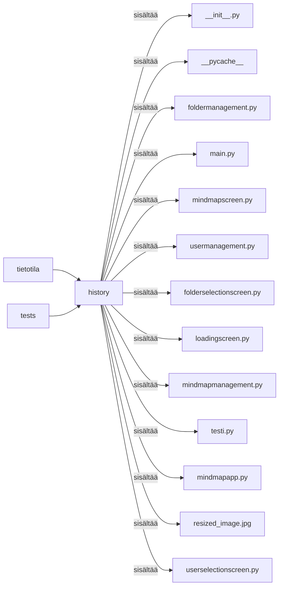

# Arkkitehtuurikuvaus

## Rakenne

Ohjelman pakkausrakenne on seuraava: 

## Käyttöliittymä

Käyttöliittymä sisältää x näkymää:

## Sovelluslogiikka

## Tietojen pysyväistallennus

### Tiedostot

## Päätoiminnallisuudet

### Käyttäjän kirjaantuminen

### Uuden käyttäjän luominen

### Tietotilan(mindmapin) luominen

### Muut toiminnallisuudet

## Ohjelman rakenteeseen jääneet heikkoudet

### Käyttöliittymä
