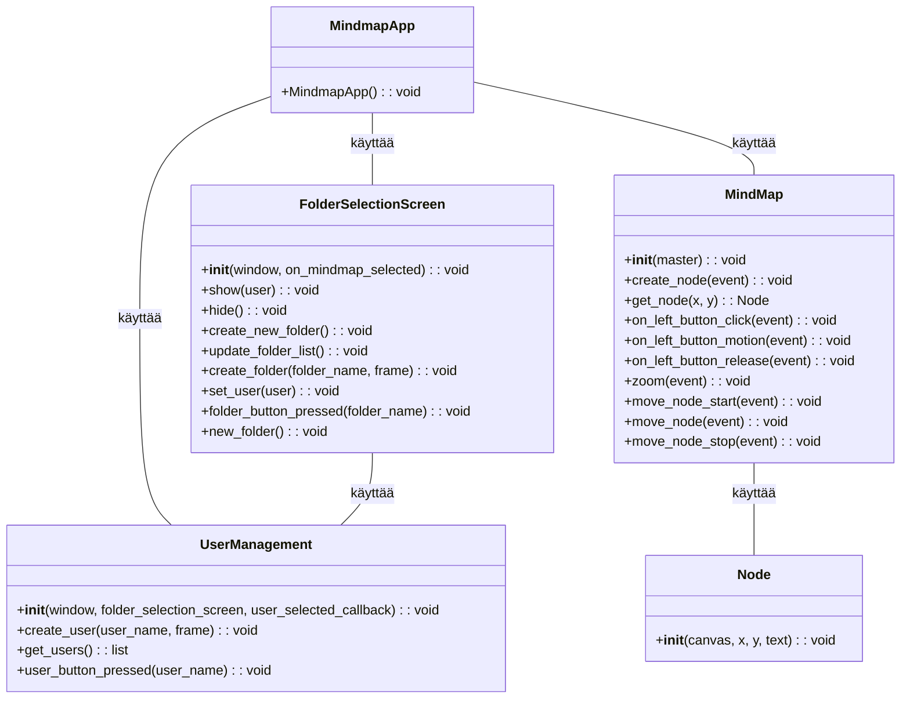

```mermaid
classDiagram

class MindmapApp {
    +MindmapApp(): void
}

class UserManagement {
    +__init__(window, folder_selection_screen, user_selected_callback): void
    +create_user(user_name, frame): void
    +get_users(): list
    +user_button_pressed(user_name): void
}

class FolderSelectionScreen {
    +__init__(window, on_mindmap_selected): void
    +show(user): void
    +hide(): void
    +create_new_folder(): void
    +update_folder_list(): void
    +create_folder(folder_name, frame): void
    +set_user(user): void
    +folder_button_pressed(folder_name): void
    +new_folder(): void
}

class Node {
    +__init__(canvas, x, y, text): void
}

class MindMap {
    +__init__(master): void
    +create_node(event): void
    +get_node(x, y): Node
    +on_left_button_click(event): void
    +on_left_button_motion(event): void
    +on_left_button_release(event): void
    +zoom(event): void
    +move_node_start(event): void
    +move_node(event): void
    +move_node_stop(event): void
}

MindmapApp -- UserManagement: käyttää
MindmapApp -- FolderSelectionScreen: käyttää
MindmapApp -- MindMap: käyttää
FolderSelectionScreen -- UserManagement: käyttää
MindMap -- Node: käyttää

```
