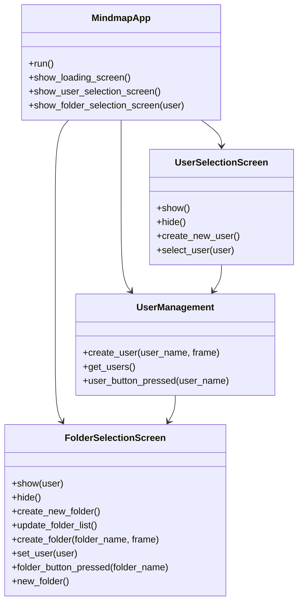

```mermaid
classDiagram
    class MindmapApp {
        +run()
        +show_loading_screen()
        +show_user_selection_screen()
        +show_folder_selection_screen(user)
    }
    class UserSelectionScreen {
        +show()
        +hide()
        +create_new_user()
        +select_user(user)
    }
    class UserManagement {
        +create_user(user_name, frame)
        +get_users()
        +user_button_pressed(user_name)
    }
    class FolderSelectionScreen {
        +show(user)
        +hide()
        +create_new_folder()
        +update_folder_list()
        +create_folder(folder_name, frame)
        +set_user(user)
        +folder_button_pressed(folder_name)
        +new_folder()
    }
    MindmapApp --> UserSelectionScreen
    MindmapApp --> UserManagement
    MindmapApp --> FolderSelectionScreen
    UserSelectionScreen --> UserManagement
    UserManagement --> FolderSelectionScreen
```
