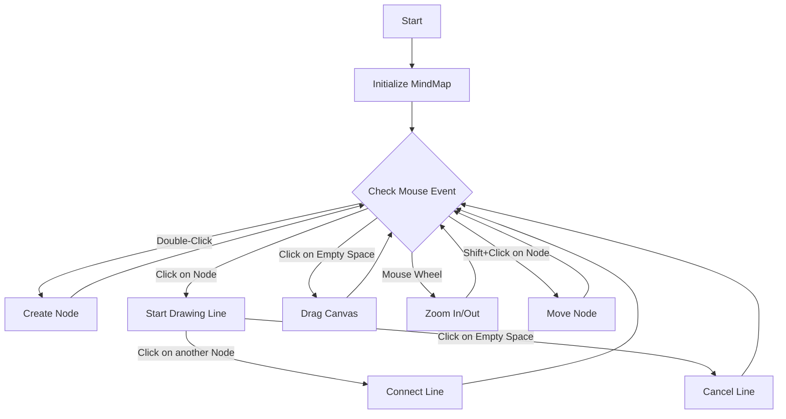

```mermaid
graph TB

A[Start] --> B[Initialize MindMap]
B --> C{Check Mouse Event}
C -->|Double-Click| D[Create Node]
C -->|Click on Node| E[Start Drawing Line]
C -->|Click on Empty Space| F[Drag Canvas]
C -->|Mouse Wheel| G[Zoom In/Out]
C -->|Shift+Click on Node| H[Move Node]
D --> C
E -->|Click on another Node| I[Connect Line]
E -->|Click on Empty Space| J[Cancel Line]
F --> C
G --> C
H --> C
I --> C
J --> C
```

