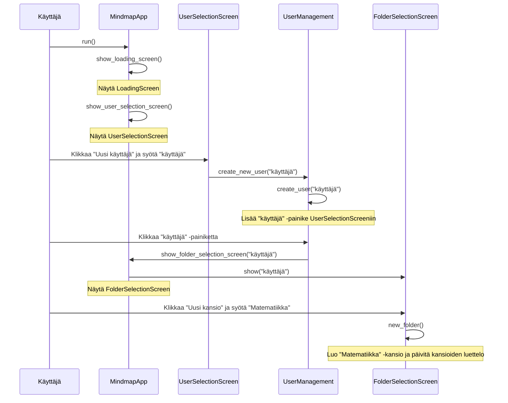

```mermaid
sequenceDiagram
    participant Käyttäjä
    participant MindmapApp
    participant UserSelectionScreen
    participant UserManagement
    participant FolderSelectionScreen

    Käyttäjä->>MindmapApp: run()
    MindmapApp->>MindmapApp: show_loading_screen()
    Note over MindmapApp: Näytä LoadingScreen
    MindmapApp->>MindmapApp: show_user_selection_screen()
    Note over MindmapApp: Näytä UserSelectionScreen
    Käyttäjä->>UserSelectionScreen: Klikkaa "Uusi käyttäjä" ja syötä "käyttäjä"
    UserSelectionScreen->>UserManagement: create_new_user("käyttäjä")
    UserManagement->>UserManagement: create_user("käyttäjä")
    Note over UserManagement: Lisää "käyttäjä" -painike UserSelectionScreeniin
    Käyttäjä->>UserManagement: Klikkaa "käyttäjä" -painiketta
    UserManagement->>MindmapApp: show_folder_selection_screen("käyttäjä")
    MindmapApp->>FolderSelectionScreen: show("käyttäjä")
    Note over MindmapApp: Näytä FolderSelectionScreen
    Käyttäjä->>FolderSelectionScreen: Klikkaa "Uusi kansio" ja syötä "Matematiikka"
    FolderSelectionScreen->>FolderSelectionScreen: new_folder()
    Note over FolderSelectionScreen: Luo "Matematiikka" -kansio ja päivitä kansioiden luettelo

```
