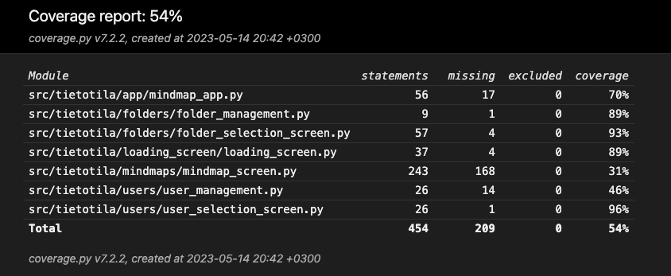

# Testaus

Ohjelmani graafinen käyttöliittymä ja toimintalogiikka on huonosti eroteltu, joten epäonnistuin kattavien testien luomisessa. Kuitenkin ne osat jotka kuuluvat selkeästi toimintalogiikkaan sain testattua. 

### Sovelluslogiikka

Haarautumakattavuus on 54%

Sovelluslogiikan testit tuottivat seuraavan tuloksen: 

## Järjestelmätestaus

Itse sovelluksen toiminnan testaus on suoritettu manuaalisesti virtuaalityöasemassa.

### Toiminnallisuudet

[määrittelydokumentin](https://github.com/ErikHuuskonen/ot-harjoitustyo/blob/main/dokumentaatio/vaatimusmaarittely.md) ja käyttöohjeen listaamat toiminnallisuudet on käyty läpi manuaalisesti virtuaalityöasemassa. 

## Sovelluksen heikkoudet ja laatuongelmat

-Sovellus ei anna virheilmoituksia.
-Sovelluksen käyttöliittymä ja toimintalogiikka ei ole tarpeeksi eritelty
-Sovellus on herkkä suoritysympäristöleen ja konsolin valinnalla on ohjelman toiminnan kannalta väliä Linux-käyttöjärjestelmissä. 
-Mindmap-näkymä saattaa toimia arvaamattomasti zoomauksen jälkeen Linux-käyttöjärjestelmissä. 
